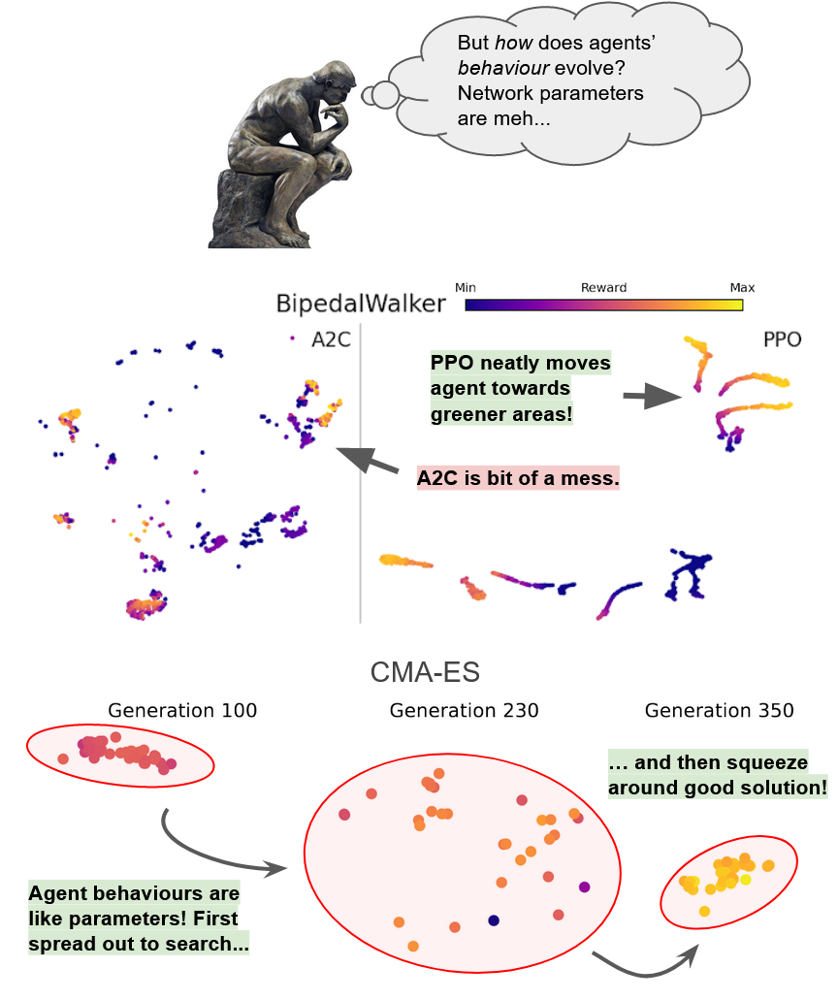

# Policy Supervectors

Source code for paper "Policy Supervectors: General Characterization of Agents by their Behaviour".

**Long story short:** Policy supervectors are fixed-length vectors that describe policy's behaviour (what states they visit),
which can be quickly compared to each other via e.g. distance. With this one can study how a training algorithm evolves
policies, as demonstrated in the image above.

## Running the code
Experiment code is in Python (tested on Python 3.7) with requirements in the `requirements.txt´.

The easiest way to run the experiments is to use conda or other env-handler:

```
conda create -n pivector python=3.7
conda activate pivector
pip install -r requirements.txt
./scripts/run_all.sh
```

All data will be stored in the same directory as the code
under different directories. The final figures/results will
be printed in the console (`plot_paper.py` and `plot_appendix.py`),
and figures will be placed under `figures` directory.

See `./scripts/run_all.sh` for different scripts for different
experiments and how they should be ran.

## Example code of the method

See `plot_method_figures.py` for a mostly self-contained code on running the method
in Pendulum-v0 environment with three different agents. The resulting plots will
be placed in `figures`, and were used in the method-figure in the main paper.

## Hardware/Software requirements

The strict hardware/software requirements for running the experiments are:

* Linux-based OS (will not run correctly on Windows)
* At least 64GB of system memory
* At least ~300GB of free space available (data is stored in this same directory)

No GPU or specific CPU are required. Only required software is Python and libraries specified in `requirements.txt` (open and freely available).

On a four-core Intel Xeon system experiments take roughly three to five days.
They are not parallelized to ensure we do not run out of system memory during runs.
